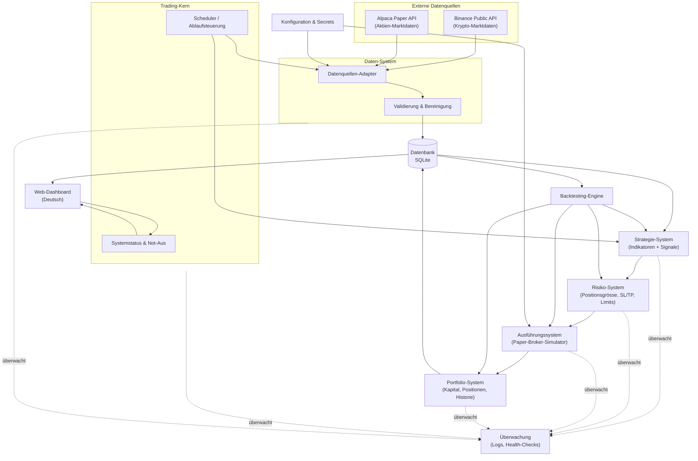
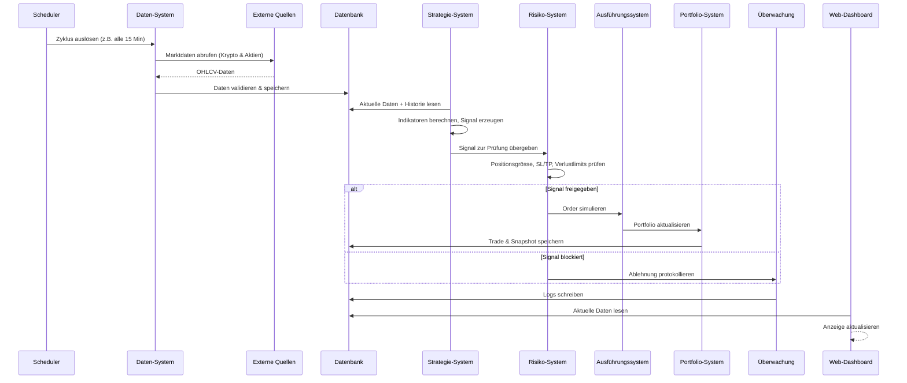

# Phase 1 – Systemarchitektur

Status: **Abgeschlossen** (wartet auf deine Bestätigung, um zu Phase 2 überzugehen)
Datum: 2026-07-17

Grundlage: Ergebnisse aus [00_projektanalyse.md](00_projektanalyse.md)
(Kryptowährungen + Aktien, Swing Trading, Risiko mittel, macOS, Web-Dashboard, 0 € Budget in der
Entwicklungsphase).

Hinweis: In dieser Phase wird **nur geplant, kein Code geschrieben**. Konkrete Bibliotheken/Frameworks
werden erst in Phase 2 (Technologieauswahl) final festgelegt – hier geht es um Struktur und
Verantwortlichkeiten.

---

## 1. Architekturprinzipien

Bevor die einzelnen Komponenten beschrieben werden, die Leitlinien, an denen sich alle folgenden
Entscheidungen orientieren:

- **Modularer Monolith statt Microservices.** Ein einziges Python-Projekt mit klar getrennten
  Modulen. Begründung: Solo-Entwicklung, 0 €-Budget, kein Hochfrequenzhandel (Swing Trading braucht
  keine verteilten Systeme). Microservices würden nur unnötige Komplexität und Betriebsaufwand
  erzeugen (verstösst gegen Regel 6 "keine unnötige Komplexität").
- **Geplante Abfragen (Scheduler) statt Echtzeit-Streaming.** Da Swing-Positionen über Tage/Wochen
  gehalten werden, reicht ein Abfrage-Rhythmus von z. B. 15 Minuten bis 1 Stunde. Ein
  Websocket-Streaming mit Tick-Daten wäre für diesen Handelsstil unnötiger Overhead.
- **Gleiche Logik für Backtesting und Paper-Trading.** Strategie-, Risiko-, Ausführungs- und
  Portfolio-Module werden so gebaut, dass sie sowohl im Backtest als auch im Live-Paper-Betrieb
  identisch verwendet werden. So sind Backtest-Ergebnisse wirklich aussagekräftig für den Live-Betrieb.
- **Austauschbarkeit für später.** Datenquellen und Order-Ausführung werden hinter Schnittstellen
  (Adaptern) versteckt, damit später eine echte Broker-Anbindung (Phase 12) ergänzt werden kann, ohne
  Strategie-, Risiko- oder Portfolio-Logik anzufassen.
- **Sicherheit von Anfang an mitdenken.** Auch wenn Details erst in Phase 11 umgesetzt werden, wird
  die Architektur bereits so geplant, dass API-Schlüssel niemals im Code stehen, sondern über eine
  eigene Konfigurationsschicht verwaltet werden.

---

## 2. Systemkomponenten

| # | Komponente | Verantwortlichkeit |
|---|---|---|
| 1 | **Trading-Kern (Core)** | Ablaufsteuerung, Scheduler-Zyklus, Systemstatus (läuft/pausiert), Not-Aus |
| 2 | **Daten-System** | Abruf, Prüfung und Speicherung von historischen und aktuellen Marktdaten |
| 3 | **Strategie-System** | Berechnung von Indikatoren, Erzeugung von Handelssignalen |
| 4 | **Risiko-System** | Positionsgrösse, Stop-Loss/Take-Profit, Verlustlimits, Freigabe/Blockade von Signalen |
| 5 | **Ausführungssystem** | Simulation von Orders (Paper-Broker), später echte Broker-Anbindung |
| 6 | **Portfolio-System** | Kapitalverwaltung, Positionen, Trade-Historie, Performance-Kennzahlen |
| 7 | **Backtesting-Engine** | Spielt Strategie/Risiko/Ausführung/Portfolio auf historischen Daten durch |
| 8 | **Dashboard** | Deutsche Web-Oberfläche zur Anzeige und Steuerung |
| 9 | **Überwachung (Monitoring)** | Logging, Fehlerbehandlung, Health-Checks, spätere Benachrichtigungen |
| 10 | **Konfiguration & Sicherheit** | Zentrale Einstellungen, sichere Verwaltung von API-Schlüsseln |

### Komponentendiagramm



---

## 3. Datenquellen

| Markt | Quelle | Kosten | Zweck |
|---|---|---|---|
| Kryptowährungen | Binance Public REST API | Kostenlos (Konto optional, erhöht nur Rate-Limits) | Historische + aktuelle Kerzendaten (OHLCV) |
| Aktien | Alpaca Paper-Trading API | Kostenlos mit Konto | Historische + aktuelle Kursdaten (OHLCV) |

**Warum kein direktes Order-Ausführen über die Alpaca-Paper-API, obwohl sie das könnte?**
Binance bietet keine offizielle Paper-Trading-Order-Simulation für Krypto. Damit Krypto- und
Aktien-Trades nach **denselben Regeln** simuliert werden (gleiche Gebühren-Logik, gleiches
Slippage-Modell, gleiche Risiko-Prüfung), baut das System einen **eigenen Paper-Broker-Simulator**
(siehe Ausführungssystem). Die Marktdaten kommen weiterhin direkt von Binance/Alpaca – nur die
Order-Ausführung wird selbst simuliert. Das ist auch Voraussetzung für ein realistisches
Backtesting, das exakt dieselbe Logik verwendet wie der Live-Paper-Betrieb.

Beide Datenquellen werden hinter einem einheitlichen **Adapter-Interface** angebunden, sodass
Strategie-, Risiko- und Portfolio-Module nicht wissen müssen, ob eine Kerze von Binance oder Alpaca
stammt.

---

## 4. Backend-Struktur

Modularer Monolith als ein Python-Projekt. Grobe Modulaufteilung (Verantwortlichkeiten, **kein
Code**):

```
tradingbot/
├── core/          # Scheduler, Ablaufsteuerung, Systemstatus, Not-Aus
├── data/          # Adapter (Binance/Alpaca), historische Loader, Validierung, Persistenz
├── strategy/      # Indikatoren, Strategie-Interface, konkrete Strategien (ab Phase 5)
├── risk/          # Positionsgrössen-Rechner, SL/TP-Logik, Verlustlimits
├── execution/     # Paper-Broker-Simulator, Broker-Interface für später
├── portfolio/     # Kapitalverwaltung, Trade-Historie, Performance-Kennzahlen
├── backtest/      # Backtesting-Engine (nutzt strategy/risk/execution/portfolio wieder)
├── dashboard/     # Web-Oberfläche (Deutsch)
├── monitoring/    # Logging, Health-Checks, spätere Benachrichtigungen
└── config/        # Einstellungen, sichere Verwaltung von API-Schlüsseln
```

Jedes Modul kommuniziert nur über klar definierte Schnittstellen mit den anderen – z. B. kennt das
Strategie-Modul keine Details der Order-Ausführung, und das Risiko-Modul kennt keine
Indikator-Berechnung. Das hält die Komponenten einzeln testbar (Regel 8: "Jede Funktion muss
getestet werden").

---

## 5. Datenbank

**Wahl für die Entwicklungsphase: SQLite**
Begründung: dateibasiert, kein separater Datenbankserver nötig, 0 € Kosten, für die Datenmengen im
Swing-Trading (wenige Kerzen pro Stunde statt Tick-Daten) mehr als ausreichend.

Der Datenbankzugriff wird über eine **Abstraktionsschicht** geplant (konkrete Technologie/ORM in
Phase 2), damit ein späterer Umstieg auf PostgreSQL (z. B. bei 24/7-Betrieb auf einem VPS mit
höheren Anforderungen an Zuverlässigkeit und Nebenläufigkeit) ohne grössere Umbauten möglich ist.

### Grobes Datenmodell (konzeptionell)

| Tabelle | Inhalt |
|---|---|
| `marktdaten` | Symbol, Zeiteinheit, Zeitstempel, Open/High/Low/Close, Volumen, Quelle |
| `signale` | Zeitstempel, Symbol, Strategie, Signal-Typ (Kaufen/Verkaufen/Halten), Begründung/Indikatorwerte |
| `trades` | Einstiegs-/Ausstiegszeit, Symbol, Richtung, Menge, Einstiegs-/Ausstiegspreis, Gebühren, Ergebnis |
| `positionen` | Aktuell offene Positionen: Menge, Einstiegspreis, aktueller Stop-Loss/Take-Profit |
| `portfolio_snapshots` | Zeitstempel, Gesamtkapital, Cash, Positionswert, Tages-Gewinn/Verlust |
| `system_logs` | Zeitstempel, Level (Info/Warnung/Fehler), Modul, Nachricht |
| `konfiguration` | Strategie-Parameter, Risiko-Parameter, aktiv/inaktiv-Status |

---

## 6. Strategie-Engine

Hinweis: Hier wird nur die **Architektur** der Strategie-Engine geplant. Die konkrete Strategie
(Regeln, Indikatoren, Ein-/Ausstieg) folgt in Phase 5.

- **Einheitliches Strategie-Interface**: Jede Strategie erhält Marktdaten + berechnete Indikatoren
  als Eingabe und liefert ein Signal (Kaufen/Verkaufen/Halten) inkl. nachvollziehbarer Begründung
  als Ausgabe.
- **Trennung von Indikator-Berechnung und Strategie-Logik**: Indikatoren (z. B. gleitende
  Durchschnitte, RSI, MACD) sind wiederverwendbare Bausteine, unabhängig von der Strategie, die sie
  kombiniert.
- **Mehrere Strategien parallel möglich**: Die Engine ist so angelegt, dass mehrere Strategien
  gleichzeitig registriert und verglichen werden können (wichtig für Phase 5/6, wenn Strategien
  gegeneinander getestet werden).
- **Bewusste Trennung von Risiko und Ausführung**: Die Strategie-Engine entscheidet **nur** über das
  Signal, nicht über Positionsgrösse oder ob der Trade tatsächlich ausgeführt wird. Das stellt
  sicher, dass die Risiko-Regeln zentral und einheitlich für alle Strategien gelten (Single
  Responsibility).

---

## 7. Backtesting-Umgebung

- Eigenständiges Modul (`backtest/`), das dieselbe Strategie-, Risiko-, Ausführungs- und
  Portfolio-Logik wie der Live-Paper-Betrieb auf **historischen Daten** durchspielt.
- **Warum dieselbe Logik statt eines separaten Test-Frameworks?** Nur so sind Backtest-Ergebnisse
  wirklich repräsentativ für das, was der Bot später im Live-Paper-Betrieb tut. Ein separates,
  abweichendes Testsystem würde das Risiko bergen, dass Backtest und Realität auseinanderlaufen.
- Berücksichtigt von Anfang an: Handelsgebühren, ein Slippage-Modell und realistische
  Ausführungsannahmen – insbesondere wird kein "Blick in die Zukunft" (Look-Ahead-Bias) zugelassen:
  eine Strategie darf zum Zeitpunkt t nur Daten bis t kennen.
- Ergebnis eines Backtests: ein Kennzahlen-Report (Gewinn/Verlust, Drawdown, Trefferquote, Sharpe
  Ratio – Details in Phase 6) plus vollständige Trade-Liste, beides im Dashboard einsehbar.

---

## 8. Dashboard-Architektur

- **Web-basiert**, während der Entwicklungsphase lokal im Browser erreichbar; bei späterem
  VPS-Betrieb auch remote nutzbar (mit Zugriffsschutz, Details in Phase 11).
- **Klare Trennung**: Das Dashboard liest Daten aus der Datenbank/dem Portfolio-System und **löst
  selbst keine Handelslogik aus** – einzige Ausnahme sind Steuerbefehle wie Start/Pause/Not-Aus.
- Geplante Ansichten (auf Deutsch):
  - **Portfolio-Übersicht**: Gesamtkapital, Cash, offene Positionen, Tages-/Gesamt-Gewinn
  - **Trading-Ansicht**: aktive Trades, Trade-Historie, Strategie-Entscheidungen mit Begründung
  - **Backtesting-Ansicht**: Ergebnisse vergangener Backtests, Kennzahlen-Vergleich
  - **System-Status**: läuft/pausiert, Zeitpunkt des letzten Datenabrufs, Fehler-/Warn-Log,
    Not-Aus-Schalter
- Konkrete Technologie (z. B. Streamlit vs. eigenes Backend mit Frontend) wird in **Phase 2**
  festgelegt.

---

## 9. Deployment-Strategie

| Phase | Umgebung | Beschreibung |
|---|---|---|
| Entwicklung (jetzt) | Lokal auf macOS | Manueller Start, SQLite-Datei lokal, kein Zugriff von aussen nötig |
| Paper-Trading-Dauerbetrieb (ab Phase 7–9) | Lokal oder optional VPS | Lokal möglich, solange der Mac läuft; alternativ früh ein günstiger VPS (~5 €/Monat), falls durchgehender Betrieb gewünscht ist – Entscheidung situativ |
| 24/7-Betrieb (Phase 10) | Linux-VPS | Prozess als Hintergrunddienst mit automatischem Neustart bei Absturz, regelmässige Datenbank-Backups, Monitoring mit Benachrichtigung bei Fehlern |

Bewusst **kein Docker/Kubernetes** in der Anfangsphase – das wäre unnötige Komplexität für ein
Solo-Projekt in dieser Grösse (Regel 6). Ein einfacher Docker-Container für eine saubere
VPS-Bereitstellung kann in Phase 10 bei Bedarf ergänzt werden.

---

## 10. Datenfluss (ein vollständiger Zyklus)



---

## 11. Offene Entscheidungen für Phase 2 (Technologieauswahl)

Diese Architektur legt Struktur und Verantwortlichkeiten fest, aber noch **keine konkreten
Bibliotheken**. In Phase 2 wird begründet festgelegt:

- Konkrete Python-Bibliotheken für Datenanalyse/Indikatoren
- Scheduler-Mechanismus
- Datenbank-Zugriffsschicht (ORM oder direkter Zugriff)
- Dashboard-Framework (z. B. Streamlit vs. FastAPI + Frontend)
- Testing-Framework für die geforderten Modultests

---

## 12. Nächste Schritte

Diese Architektur bildet die Grundlage für alle weiteren Phasen. Vor Phase 3
(Entwicklungsumgebung) wird eine **Checkliste benötigter Zugänge und Installationen** erstellt
(GitHub, Python, VS Code, Binance, Alpaca) – wie in Phase 0 angekündigt.

**Phase abgeschlossen. Möchtest du mit der nächsten Phase fortfahren?**

---

## 13. Nachtrag aus Phase 2 (Technologieauswahl)

Die kritische Prüfung dieser Architektur in
[02_technologieauswahl.md](02_technologieauswahl.md) hat vier Lücken identifiziert und mit
konkreten Technologien geschlossen. Die Grundstruktur (Abschnitte 1–11) bleibt unverändert gültig,
folgende Präzisierungen kommen hinzu:

- **Prozess-Trennung:** Trading-Kern und Dashboard laufen als **zwei getrennte Prozesse** derselben
  Codebasis (nicht ein einzelner Prozess, wie ursprünglich implizit angenommen), damit ein
  Dashboard-Request den Trading-Zyklus nicht verzögern kann. Kommunikation weiterhin über die
  Datenbank sowie eine schlanke interne FastAPI-Schnittstelle für Steuerbefehle.
- **SQLite-Nebenläufigkeit:** Die Datenbank läuft im **WAL-Modus**, damit gleichzeitiges Lesen
  (Dashboard) und Schreiben (Core) ohne Sperrfehler funktioniert.
- **Börsenkalender:** Der Scheduler (Abschnitt 1, "geplante Abfragen") berücksichtigt für
  Aktien-Symbole zusätzlich Börsenöffnungszeiten und Feiertage; Krypto-Symbole werden weiterhin
  durchgehend abgefragt.
- **Konfigurationsschicht:** Konkretisiert in zwei Teile – Geheimnisse/Umgebungseinstellungen über
  eine validierte, nicht versionierte `.env`-Datei; Strategie-/Risiko-Parameter über eine
  versionierbare TOML-Datei.

Details und Begründungen siehe [02_technologieauswahl.md](02_technologieauswahl.md), Abschnitt 1
und die jeweiligen Technologie-Entscheidungen.
